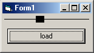



## Slider for MP3 Player

### Description

Most of you have used winamp and know about its slider. It slides along with the song and you can drag it around to change the current position. This code does the same thing! It shows you how to draw a slider, restrict its movement, and make it move along with the song! The code is fully commented!
 
### More Info
 

             |
---                |---
**Submitted On**   |2000-10-01 01:42:04
**By**             |[Izek](https://github.com/Planet-Source-Code/PSCIndex/blob/master/ByAuthor/izek.md)
**Level**          |Intermediate
**User Rating**    |4.3 (51 globes from 12 users)
**Compatibility**  |VB 4\.0 \(32\-bit\), VB 5\.0, VB 6\.0, VB Script
**Category**       |[Sound/MP3](https://github.com/Planet-Source-Code/PSCIndex/blob/master/ByCategory/sound-mp3__1-45.md)
**World**          |[Visual Basic](https://github.com/Planet-Source-Code/PSCIndex/blob/master/ByWorld/visual-basic.md)
**Archive File**   |[CODE\_UPLOAD103281012000\.zip](https://github.com/Planet-Source-Code/izek-slider-for-mp3-player__1-11806/archive/master.zip)

